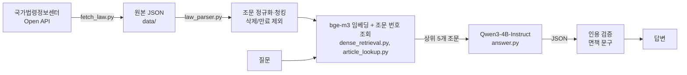

# LawLens: 근로기준법 조문 Q&A (RAG)

"월급이 밀렸어요", "내일부터 나오지 말래요" 같은 일상어 질문에 **근로기준법·시행령·시행규칙 조문을 찾아 근거와 함께** 답하는 RAG 시스템입니다.
국가법령정보센터 Open API에서 받은 조문을 조 단위로 인덱싱하고, 로컬 임베딩 모델로 검색한 뒤 로컬 LLM이 답변을 생성합니다.
답변에 쓰인 인용은 코드로 검증합니다.

> **면책**: 법령 조문 안내용이며 법률 자문이 아닙니다. 판례 해석, 개별 사건 판단 같은 범위 밖 질문은 거절합니다.

## 주요 결과

평가셋은 두 개입니다. **dev**(63문항)는 개발 중 오답을 보며 쓴 셋이고, **test**(50문항)는 개발에 쓰지 않도록 따로 만든 셋입니다.

- **검색**: bge-m3 dense 검색을 적용해 dev hit@3가 0.509(BM25 + 일상용어 확장)에서 **0.836**으로 올랐습니다. test에서도 dense가 가장 높았습니다(**0.778**).
- **조문 번호 직접 조회**: "제26조가 무슨 내용이에요?"처럼 번호만 있는 질문을 위해 추가했습니다. test hit@3가 0.778에서 **0.833**으로, 정답 조문 포함이 26/36에서 **28/36**으로 올랐습니다 (test 두 번째 측정, [아래](#조문-번호-직접-조회-현재-기본-설정) 참고).
- **거절**: 범위 밖 질문을 dev **8/8**, test **14/14** 거절했습니다.
- **인용 검증**: 검색 결과에 없는 조문을 인용한 **1건**(dev)을 코드 검증 단계에서 찾아 무효 처리했습니다.
- **답변 평가** (조문 번호 조회 추가 전 측정): 답변을 자동 지표와 조문 원문 직접 대조, 두 가지 방식으로 평가했습니다. 두 결과는 서로 다른 것을 측정합니다.
  - 정답 조문 포함 (자동 지표): 범위 안 질문 중 답변이 정답 조문을 근거로 인용한 수입니다. 인용 여부만 판정합니다. dev **45/55**, test **26/36**.
  - 내용 정확도 (수동 검토): 정답 조문을 인용한 답변 중 조문 내용과 일치한 수입니다. dev **39/45**, test **19/26**.
    나머지는 dev가 부분 오류 3개·결론이 조문과 반대 3개, test가 부분 오류 4개·결론이 조문과 반대 3개입니다.

```
$ python ask.py "출산휴가는 며칠이고 쌍둥이면 더 길어지나요?"
출산휴가는 90일이며, 미숙아를 출산한 경우 100일, 한 번에 둘 이상 자녀를 임신한 경우(쌍둥이)는 120일로 더 길어진다.

[근거 조문]
- 근로기준법 제74조(임산부의 보호)

※ 이 답변은 법령 조문 안내이며 법률 자문이 아닙니다. 개별 사안은 노무사·변호사 또는 고용노동부 고객상담센터(국번 없이 1350)에 문의하세요.

$ python ask.py "제 경우에 부당해고 소송하면 이길 수 있을까요?"
이 질문에는 답변드리기 어렵습니다. (… 판례 해석이나 개별 사건의 결과를 묻는 질문입니다.)

[검증 경고] 제공된 조문에 없는 인용을 제외했습니다: 근로기준법 시행령 제5조
```

두 번째 예시에서 모델은 검색 결과에 존재하지 않는 "근로기준법 시행령 제5조"를 인용했습니다.
코드의 인용 검증 단계는 이 인용을 검색된 조문 목록과 대조해 "검색 결과에 없는 인용"으로 판정하고 무효 처리했습니다.
위 경고 문구가 그 결과입니다.

## 결과 요약

기준일 2026-10-07, 검색 대상 청크 251개.

- **dev** (`eval/questions.jsonl`): 일상어 질문 55개(정답 = 조문)와 범위 밖 질문 8개. 개발 중 검색기·답변을 비교할 때마다 오답을 보며 썼습니다.
- **test** (`eval/test_questions.jsonl`): 범위 안 36개와 범위 밖 14개. 이 프로젝트를 모르는 별도 LLM 대화에서 질문을 생성하고 작성자가 검토했습니다.
  정답 조문은 원문과 대조해 붙였고, dev와 같은 조항·같은 결론인 문항은 뺐습니다. 작성 과정은 [`eval/test_set.md`](eval/test_set.md)에 있습니다.
- **운영 규칙**: 튜닝과 선택은 dev 점수로만 하고, test는 최종 후보를 정한 뒤에만 측정합니다. 아래 test 수치는 첫 측정입니다.

### 검색 (정답 조문이 상위 k개 안에 있는 비율)

**dev** (범위 안 55)

| 검색기 | hit@1 | hit@3 | hit@5 | MRR@10 |
|---|---|---|---|---|
| BM25 (글자 2-gram) | 0.327 | 0.400 | 0.473 | 0.397 |
| BM25 + 일상용어→법령용어 확장 | 0.436 | 0.509 | 0.600 | 0.502 |
| **bge-m3 임베딩** | **0.727** | **0.836** | **0.873** | **0.796** |
| 하이브리드 (RRF: BM25+확장, bge-m3) | 0.600 | 0.727 | 0.800 | 0.683 |

**test** (범위 안 36)

| 검색기 | hit@1 | hit@3 | hit@5 | MRR@10 |
|---|---|---|---|---|
| BM25 (글자 2-gram) | 0.500 | 0.639 | 0.694 | 0.596 |
| BM25 + 일상용어→법령용어 확장 | 0.444 | 0.639 | 0.722 | 0.555 |
| **bge-m3 임베딩** | **0.722** | **0.778** | **0.806** | **0.764** |
| 하이브리드 (RRF: BM25+확장, bge-m3) | 0.583 | 0.694 | 0.806 | 0.668 |

- test에서는 BM25가 dev보다 크게 높습니다. test 질문에 "감급", "휴업보상"처럼 조문에 그대로 나오는 법률 용어가 많기 때문입니다. 일상용어 확장은 test에서 효과가 없었습니다.
- 조문 번호로 묻는 질문(test 8개)은 두 검색기 모두 약합니다. 예를 들어 "근로기준법 제26조가 어떤 내용인가요?"에서 제26조가 dense 23위였습니다.

### 답변 생성 및 검증 (Qwen3-4B-Instruct, 근거 조문 5개)

| 지표 | dev | test |
|---|---|---|
| 범위 밖 질문 거절 | **8/8** | **14/14** |
| 정답 조문 포함 (답변이 정답 조문을 인용했는지, 내용 정확도 아님) | **45/55** | **26/36** |
| 답해야 할 질문 거절 | 6/55 | 7/36 |
| └ 그중 검색이 정답 조문을 못 가져온 경우 (근거 없으면 거절하도록 설계됨) | 5 | 5 |
| 검색 결과에 없는 조문 인용 | 1/63 (코드가 잡아냄) | 0/50 |
| JSON 형식 오류 | 0/63 | 0/50 |

위 자동 지표는 정답 조문을 인용했는지만 보고, 답변 내용이 조문과 맞는지는 판정하지 않습니다.
그래서 답변을 조문 원문과 직접 대조해 내용 정확도를 따로 평가했습니다.

| 수동 검토 (정답 조문을 인용한 답변 중) | dev | test |
|---|---|---|
| 내용 정확 | **39/45** | **19/26** |
| 부분 오류 | 3 | 4 |
| 결론이 조문과 반대 | 3 | 3 |

- 검토 문서: [dev](eval/results/review_qwen3-4b-instruct-2507_k5.md), [test](eval/results/review_qwen3-4b-instruct-2507_k5_test.md)
- dev의 오류는 여러 조문이나 예외 조건을 연결해야 하는 질문에 몰려 있습니다.
- test의 결론 반대 오류는 숫자·한도 조건을 잘못 읽은 경우입니다. 예를 들어 "4시간이면 30분 휴게"를 "8시간 넘게 일해야 30분"으로 답했습니다. 근거 조문은 맞게 가져왔으므로 검색이 아니라 모델의 문제입니다.
- test에서는 정답이 아닌 조문을 인용한 답변이 3건 있었고, 모두 결론이 틀렸습니다.

### 조문 번호 직접 조회 (현재 기본 설정)

test에서 "근로기준법 제26조가 어떤 내용인가요?"의 제26조가 dense 23위였습니다. 번호만 있고 주제어가 없으면 임베딩 검색이 못 찾습니다.
질문에 조문 번호가 있으면 그 조문을 근거 맨 앞에 고정하도록 했습니다. 개발은 dev로만 했습니다.

- dev에 조문 번호 질문 25개(번호만 있는 질문, 항 단위로 나뉜 긴 조문, 전제가 틀린 질문 포함)와 다른 법 조문 번호를 묻는 범위 밖 질문 2개를 추가했습니다. 기존 dev 문항은 그대로입니다.
- `ctx@5`는 LLM에 실제로 넘기는 상위 5개 청크 안에 정답 조문이 있는 비율입니다. hit@k는 같은 조의 청크를 하나로 묶어 세기 때문에, 한 조문이 근거 자리를 독점하는 문제를 보지 못해서 추가했습니다.

| dev | 조회 없음 (dense) | **조회 적용** |
|---|---|---|
| 조문 번호 질문 25개 hit@3 / ctx@5 | 0.800 / 0.920 | **1.000 / 1.000** |
| 기존 질문 55개 hit@3 / ctx@5 | 0.836 / 0.873 | 0.836 / 0.873 (변화 없음) |

| test | 조회 없음 | 조회 적용 (첫 측정) | **조회 적용, 결함 수정 후 (두 번째 측정)** |
|---|---|---|---|
| 검색 hit@3 | 0.778 | 0.833 | **0.833** |
| 정답 조문 포함 | 26/36 | 27/36 | **28/36** |
| 답해야 할 질문 거절 | 7/36 | 6/36 | **5/36** |
| 범위 밖 질문 거절 | 14/14 | 14/14 | 14/14 |

- **test를 두 번 측정했습니다.** 첫 측정에서 결함이 드러났습니다. 항 단위로 나뉜 긴 조문(제74조)의 청크를 전부 고정해서 근거 5자리를 독점하고, 정답 제74조의2를 밀어냈습니다.
  같은 유형을 dev에 추가해 dev에서 고친 뒤 test를 다시 쟀으므로, 두 번째 수치는 완전한 홀드아웃 수치가 아닙니다.
- 조회 없음과 두 번째 측정을 비교하면 50문항 중 바뀐 답변은 3개(t11, t22, t18 복구)이고, 셋 다 조문과 일치합니다. 수동 검토 기준 내용 정확은 19/26에서 21/28이 됐습니다.

## 구조



| 단계 | 파일 | 내용 |
|---|---|---|
| 수집 | `fetch_law.py` | 법령명으로 검색해 **기준일에 시행 중인 버전**을 골라 본문 JSON 저장 |
| 파싱 | `law_parser.py` | 조·항·호·목 정규화, 개정 태그 제거, 삭제·만료 조문 판별, 조 단위 청킹 |
| 검색 | `dense_retrieval.py`, `article_lookup.py` | bge-m3 dense 임베딩 + 코사인 유사도 (+ RRF 하이브리드), 질문 속 조문 번호 직접 조회 |
| 검색 (기준선) | `eval_retrieval.py`, `term_expansion.py` | BM25, 법제처 일상용어-법령용어 사전으로 질의 확장 |
| 답변 | `answer.py`, `ask.py` | 프롬프트, 로컬 LLM, 인용 검증, 거절, 면책 문구 |
| 평가 | `eval_retrieval.py`, `eval_answers.py` | 검색 hit@k / MRR, 답변 거절·인용 지표 |

## 설계 결정

**데이터와 파싱**
- **조 단위 청킹**: 법률 질문의 답은 대개 조 하나에 들어 있고, 인용도 조 단위로 합니다. 1000자를 넘는 긴 조만 항 단위로 나눕니다.
- **만료 판정은 보수적으로**: "…까지 유효함" 문구를 해석해 만료된 조나 항을 뺍니다.
  범위가 애매하면 조문을 지우지 않습니다. 예를 들어 "이 조 제1호의 개정규정 중 …에 관한 부분"처럼 호 일부만 만료되는 경우입니다.
  살아 있는 조문이 검색에서 사라지는 쪽이 더 위험하기 때문입니다. 실제로 시행령 두 조가 통째로 빠지던 오판정을 이 원칙으로 고쳤습니다.
- **버전 선택**: 같은 법령이라도 연혁·현행·시행예정 버전이 함께 조회됩니다. 시행일자가 기준일 이전인 버전 중 가장 최근 것을 고릅니다.

**검색**
- **bge-m3 dense 검색을 기본으로 고른 이유**: 일상어 질문과 법률 용어 사이의 어휘 차이를 줄이려고 dense 검색을 적용했습니다.
  BM25 + 일상용어 확장(hit@1 0.436 / hit@3 0.509)보다 bge-m3(hit@1 0.727 / hit@3 0.836)가 높았기 때문에,
  dev 기준으로 bge-m3 dense 검색을 기본 검색기로 정했습니다. 이후 따로 만든 test에서도 dense가 가장 높았습니다(hit@3 0.778).

- **조문 번호 직접 조회**: 번호는 사용자가 근거를 정확히 지정한 것이므로 검색보다 조회가 맞다고 봤습니다.
  - "남녀고용평등법 제14조의2"처럼 다른 법 이름이 붙은 번호는 무시합니다. 근로기준법에도 같은 번호가 있어서, 잘못 고정하면 엉뚱한 근거로 답하게 됩니다.
  - 긴 조문은 항을 지정하면 그 항만, 지정하지 않으면 최대 2개 청크만 고정합니다. 근거 5자리 중 3자리 이상을 검색 결과에 남기기 위해서이며, 이 값은 평가 점수로 고르지 않고 미리 정했습니다.

**평가**
- **평가셋 과적합 방지**
  - 일상용어 확장은 질문 단어를 법제처 사전에 그대로 조회합니다. 평가셋 오답을 보고 동의어를 손으로 넣지 않았습니다.
  - 확장 가중치도 미리 정한 0.5를 썼습니다. 1.0이 hit@3는 더 높았지만, 55문항을 보고 고른 값은 쓰지 않았습니다.
- **하이브리드를 기본으로 쓰지 않은 이유**: RRF로 같은 비중으로 섞으면, 훨씬 약한 어휘 검색(0.509)이 임베딩의 순위를 끌어내렸습니다.
  가중치를 조정하면 평가셋에 맞추는 셈이라 dense를 기본으로 했습니다.
  법률 용어와 조문 번호 질문이 섞인 test에서도 하이브리드(hit@3 0.694)가 dense(0.778)보다 낮았습니다.
- **dev/test 분리**: dev는 개발 중 계속 들여다봐서 더 이상 공정한 시험지가 아닙니다. 그래서 test를 새로 만들었고,
  test에서 발견한 문제(예: 조문 번호 질문)는 같은 유형을 dev에 추가해 dev에서 고친 뒤 test로 최종 확인합니다.

**답변**
- **LLM을 믿지 않고 코드로 보장**
  - 검색 결과에 없는 조문을 인용하면 무효 처리합니다.
  - 유효한 인용이 하나도 없는 답변은 거절로 바꿉니다.
  - JSON 파싱에 실패하면 거절합니다.
  - 면책 문구는 LLM이 아니라 코드가 항상 붙입니다.
- **로컬 모델**: MVP 단계라 비용이 들지 않는 로컬 모델을 썼습니다.
  - Qwen3-4B-Instruct의 모델 가중치는 bf16 기준 약 8GB이며, 검증 환경(RTX 4070 12GB)에서 양자화 없이 실행했습니다.
  - 같은 입력에 같은 답이 나오도록 greedy 디코딩을 써서 평가를 재현할 수 있습니다.
  - LLM은 `generate(system, user)` 인터페이스만 맞추면 교체할 수 있습니다.
- **JSON 형식 준수**: 처음에는 모델이 JSON 대신 일반 문장으로 답했습니다.
  질문 뒤에 형식 지시를 한 번 더 넣고, 응답 첫 글자를 `{`로 고정해서 해결했습니다.

**재현성**
- 모델 리비전(커밋 해시)을 고정했습니다.
- 법제처 API 응답(조문, 용어 사전)은 저장소에 캐시해 두어서 API 키 없이도 평가를 재현할 수 있습니다.

## 실행

### 간단 실행 (Windows)

1. Python 3.10 이상을 설치합니다 (설치 시 "Add python.exe to PATH" 체크).
2. 저장소를 내려받고 `setup.bat`을 실행합니다. 가상환경 `.venv`를 만들고 PyTorch(NVIDIA GPU가 있으면 CUDA 11.8, 없으면 CPU)와 패키지를 설치한 뒤 테스트로 확인합니다.
3. `run.bat`을 더블클릭하면 대화형 질문 창이 뜹니다. 첫 실행 때 모델 약 10GB를 `hf_cache/`로 받습니다.

### 직접 실행

요구 사항: Python 3.12.
- 테스트, 파싱, BM25 평가는 CPU에서도 실행할 수 있습니다. 파싱과 BM25 평가는 표준 라이브러리만 사용합니다.
- 임베딩 검색과 LLM 답변 생성은 NVIDIA GPU 사용을 권장합니다(검증 환경 RTX 4070 12GB).

```bash
pip install -r requirements.txt
python -m unittest -v
```

테스트는 81개입니다. 가짜 인코더와 가짜 LLM을 쓰므로 모델 다운로드나 GPU 없이 돌아갑니다.

```bash
# 질문하기 (첫 실행 시 bge-m3 ~2.2GB, Qwen3-4B ~8GB를 hf_cache/로 다운로드)
python ask.py "입사 1년 안 됐는데 연차 있나요?"
python ask.py                         # 대화형
python ask.py "..." --show-context    # 검색된 조문과 LLM 원본 응답도 출력

# 평가 (기본 dev, test는 --split test)
python eval_retrieval.py --today 2026-10-07 --retriever bm25|bm25+terms|dense|hybrid --show-misses
python eval_answers.py --today 2026-10-07      # dev 63문항, RTX 4070에서 약 9분
python eval_answers.py --today 2026-10-07 --split test
```

법령 원본 JSON과 용어 사전 캐시가 `data/`에 들어 있어서, 위 평가를 재현할 때는 Open API 인증키가 필요하지 않습니다.

법령을 새로 받으려면 [국가법령정보센터 Open API](https://open.law.go.kr) 인증키(OC)가 필요합니다.
`.env` 파일에 `LAW_OC=<인증키>`를 넣고 아래 명령을 실행하세요. 사용하는 PC의 IP를 미리 등록해야 합니다.
모델 저장 경로를 바꾸려면 `.env`에 `LAWLENS_MODEL_DIR=<경로>`를 넣습니다.

```bash
python fetch_law.py                   # 근로기준법·시행령·시행규칙, 오늘 기준 시행 버전
```

## 프로젝트 구조

```
fetch_law.py          법령 본문 다운로드 (버전 선택)
law_parser.py         조문 파싱·청킹·삭제/만료 판정
term_expansion.py     일상용어 → 법령용어 질의 확장
dense_retrieval.py    bge-m3 임베딩 검색, RRF 하이브리드
article_lookup.py     조문 번호 직접 조회
answer.py             답변 생성, 인용 검증, 면책 문구
ask.py                질문 CLI
eval_retrieval.py     검색 평가 (hit@k, MRR) + BM25 기준선
eval_answers.py       답변 평가 (거절·인용 지표)
test_*.py             단위 테스트
data/                 법령 원본 JSON, 용어 사전 캐시
eval/questions.jsonl       dev 평가셋 (정답 조문은 원문 대조로 작성)
eval/test_questions.jsonl  test 평가셋
eval/test_set.md           test 작성 기록 (생성 프롬프트, 제외 문항과 이유)
eval/results/              답변 평가 결과, 수동 검토
```

## 한계와 다음 단계

- **답변 정확도**: 여러 조문을 연결하거나 예외 조건, 숫자 한도를 읽어야 하는 질문에서 4B 모델이 틀립니다. 더 큰 모델과 dev에서 비교한 뒤 test로 확인할 예정입니다.
- **검색 실패**: 주휴수당, 빨간 날 같은 질문은 아직 정답 조문을 찾지 못합니다. 근거 수(k)는 dev에서 조정할 예정입니다.
- **별표 미포함**: 4명 이하 사업장 적용 규정처럼 답이 시행령 별표에 있는 질문은 별표가 인덱스에 없어서 답하지 못합니다.
- **평가셋 규모**: 범위 안 질문이 dev 55개, test 36개라 지표의 오차가 큽니다. dev는 개발자가 작성했고, test는 LLM으로 생성한 뒤 작성자가 검토했습니다.
- **로드맵**
  - 법률과 시행령 사이의 참조 연결 ("법 제17조제2항 단서에서…")
  - 버전별 인덱스: 개정 전후 비교
  - DB 스키마

## 출처와 라이선스

- 법령 데이터: [국가법령정보센터](https://www.law.go.kr) Open API (법제처)
- 일상용어-법령용어 연계: 법제처 지능형 법령정보지식베이스
- 임베딩 모델: [BAAI/bge-m3](https://huggingface.co/BAAI/bge-m3) (MIT)
- 언어 모델: [Qwen/Qwen3-4B-Instruct-2507](https://huggingface.co/Qwen/Qwen3-4B-Instruct-2507) (Apache-2.0)
